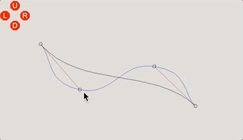
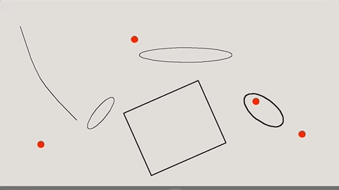

# IUM-2015-11
Midterm project for a Human-computer interaction course.

- **Exercise 1**: animates an image by manipulating a transformation matrix
- **Exercise 2**: curve editor
- **Exercise 3**: shape editor with bouncing balls

 
